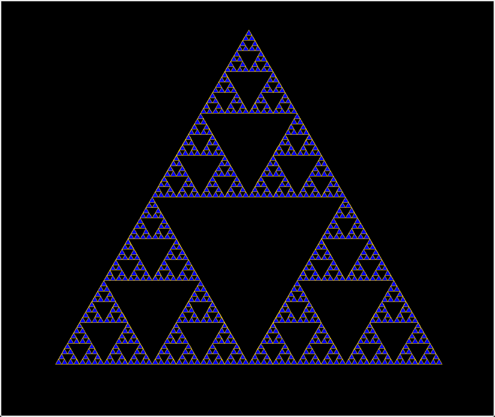

# Fractal Engine  

 
This code will generate a fractal using user input. it can have between 1 and 8 recursion layers. You can save the image. It will try to save to a 'docs' folder, but if it doesn't find one it will save in the repository outside of folders
 
## How to use the project 
*** 
1. Install PIL
2. Hit play
3. If you saved the image, it will appear in a 'docs' folder or the repository folder

## List of Key Features
***
- Creates a fractal that have between 1 and 8 recursion layers
- Saves the image

## Installation Instructions
***
All you need to do is install PIL, and it should run

## Contributors
***
- Paxton

## License Info
***
Really Doesn't Matter
